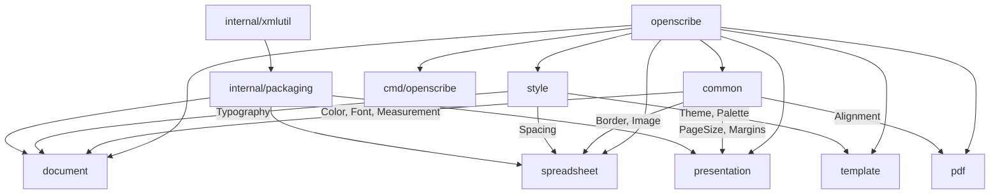

<div align="center">

# OpenScribe

**Pure Go library for creating, editing, and manipulating office documents**

[](https://go.dev)
[](LICENSE)
[](https://github.com/JohnPitter/openscribe/actions)
[](https://goreportcard.com/report/github.com/JohnPitter/openscribe)
[](https://github.com/JohnPitter/openscribe)

[Features](#features) · [Architecture](#architecture) · [Getting Started](#getting-started) · [CLI](#cli) · [Design Levels](#design-levels) · [API Examples](#api-examples) · [Performance](#performance) · [Roadmap](#roadmap)

</div>

---

## What is OpenScribe?

OpenScribe is an **open-source, pure Go** library for creating and manipulating office documents — DOCX, XLSX, PPTX, and PDF — with zero external dependencies.

Inspired by [UniDoc's](https://github.com/unidoc) suite of Go libraries (unioffice, unipdf, unihtml), OpenScribe provides a **free, MIT-licensed alternative** with a focus on:

- **Design quality** — Built-in themes from basic to premium (Behance/Freepik/Slidesgo quality)
- **Developer experience** — Fluent API with chainable methods and sensible defaults
- **Zero dependencies** — Pure Go using only the standard library
- **Full lifecycle** — Create, read, edit, and delete documents programmatically
- **Charts & visualization** — Bar, line, pie, area charts in PDF, XLSX, and PPTX

Unlike commercial alternatives, OpenScribe is **completely free** for personal and commercial use.

---

## Features

| Category | What you get |
|----------|-------------|
| **DOCX** | Create, open, edit, save. Paragraphs, headings (1-6), tables, images, headers/footers, table of contents, page breaks, sections, fonts, colors, borders |
| **XLSX** | Create, open, edit, save. Multiple sheets, cell types (string/number/boolean/formula), merged cells, charts (bar/line/pie/area/column), conditional formatting (15 rule types, color scales, data bars), formula evaluation (SUM/AVG/MIN/MAX/COUNT/ABS/ROUND), column management |
| **PPTX** | Create, open, edit, save. Slides, text boxes, shapes (12 types), charts, images, transitions (7 types with serialization), speaker notes, backgrounds, slide masters with 6 pre-built layouts, slide reordering |
| **PDF** | Create, save, merge, split, extract. Text, lines, rectangles, tables, charts (bar/line/pie/area/horizontal bar), images, watermarks, page backgrounds, text extraction from elements and raw streams, HTML-to-PDF conversion |
| **Design System** | 6 pre-built themes across 4 levels (Basic, Professional, Premium, Luxury). Palettes, typography, spacing — all customizable |
| **Templates** | 32 ready-to-use templates with `Generate()` methods — reports, invoices, resumes, letters, dashboards, pitch decks, newsletters, certificates |
| **CLI** | `openscribe` command-line tool to list templates, themes, and generate documents |
| **Pure Go** | Zero CGO, zero external deps. Compiles anywhere Go runs |

---

## Architecture



| Package | Description |
|---------|-------------|
| `common` | Shared types — Color, Font, Measurement, Border, Image, Alignment |
| `style` | Design system — Theme, Palette, Typography, Spacing with 6 pre-built themes |
| `template` | 32 pre-built templates with Generate() methods for all formats |
| `document` | DOCX — paragraphs, tables, images, headers/footers, TOC |
| `spreadsheet` | XLSX — sheets, cells, charts, formulas, conditional formatting |
| `presentation` | PPTX — slides, shapes, charts, transitions, slide masters |
| `pdf` | PDF — text, graphics, charts, tables, watermarks, HTML-to-PDF, text extraction |
| `cmd/openscribe` | CLI tool for template-based document generation |
| `internal/packaging` | ZIP-based OOXML packaging engine |
| `internal/xmlutil` | XML marshaling utilities |

---

## Getting Started

### Prerequisites

- **Go 1.22+**

### Installation

```bash
go get github.com/JohnPitter/openscribe
```

### Quick Start

#### Create a DOCX Document

```go
package main

import (
    "github.com/JohnPitter/openscribe/document"
    "github.com/JohnPitter/openscribe/style"
)

func main() {
    doc := document.NewWithTheme(style.PremiumModern())

    doc.AddHeading("Quarterly Report", 1)
    doc.AddText("This report covers Q1 2026 performance metrics.")

    // Table of contents
    toc := doc.AddTableOfContents()
    toc.SetMaxLevel(3)

    // Headers & footers
    doc.Header().SetCenter("Confidential")
    doc.Footer().SetRight("Page 1")

    // Table
    tbl := doc.AddTable(3, 2)
    tbl.Cell(0, 0).SetText("Metric")
    tbl.Cell(0, 1).SetText("Value")
    tbl.Cell(1, 0).SetText("Revenue")
    tbl.Cell(1, 1).SetText("$1.2M")
    tbl.Cell(2, 0).SetText("Growth")
    tbl.Cell(2, 1).SetText("+23%")

    doc.Save("report.docx")
}
```

#### Create an XLSX Spreadsheet with Charts

```go
package main

import (
    "github.com/JohnPitter/openscribe/spreadsheet"
    "github.com/JohnPitter/openscribe/common"
)

func main() {
    wb := spreadsheet.New()
    sheet := wb.AddSheet("Sales Data")

    // Data
    sheet.SetValue(1, 1, "Q1")
    sheet.SetValue(1, 2, "Q2")
    sheet.SetValue(1, 3, "Q3")
    sheet.SetValue(2, 1, 15000.0)
    sheet.SetValue(2, 2, 18000.0)
    sheet.SetValue(2, 3, 22000.0)

    // Formula
    sheet.Cell(2, 4).SetFormula("SUM(A2:C2)")

    // Chart
    chart := sheet.AddChart(spreadsheet.ChartTypeBar, 4, 1, 8, 12)
    chart.SetTitle("Quarterly Revenue")
    chart.SetCategories([]string{"Q1", "Q2", "Q3"})
    chart.AddSeries("Revenue", []float64{15000, 18000, 22000}, common.Blue)

    // Conditional formatting
    sheet.AddConditionalFormat("A2:C2", spreadsheet.ConditionGreaterThan).
        SetValue("17000").SetBackgroundColor(common.Green)

    wb.Save("sales.xlsx")
}
```

#### Create a PPTX Presentation with Slide Masters

```go
package main

import (
    "github.com/JohnPitter/openscribe/presentation"
    "github.com/JohnPitter/openscribe/common"
    "github.com/JohnPitter/openscribe/style"
)

func main() {
    pres := presentation.NewWithTheme(style.LuxuryAgency())

    // Use slide master with pre-built layouts
    master := presentation.DefaultMaster()
    master.SetBackground(common.NewColor(10, 10, 30))
    pres.SetSlideMaster(master)

    // Title slide from layout
    titleLayout := master.Layouts()[0] // "Title Slide"
    pres.AddSlideFromLayout(titleLayout)

    // Manual slide with chart
    s2 := pres.AddSlide()
    s2.SetTransition(presentation.NewTransition(presentation.TransitionFade, presentation.TransitionMedium))
    chart := s2.AddChart(presentation.PresentationChartBar,
        common.In(1), common.In(1), common.In(10), common.In(5))
    chart.SetTitle("Growth Metrics")
    chart.AddSeries("Users", []float64{1000, 2500, 5000}, common.Blue)

    pres.Save("pitch.pptx")
}
```

#### Create a PDF with Charts

```go
package main

import (
    "github.com/JohnPitter/openscribe/pdf"
    "github.com/JohnPitter/openscribe/common"
)

func main() {
    doc := pdf.New()
    page := doc.AddPage()

    // Title
    page.AddText("Sales Dashboard", 72, 50, common.NewFont("Helvetica", 28).Bold())

    // Bar chart
    chart := page.AddChart(pdf.ChartTypeBar, 72, 100, 400, 250)
    chart.SetTitle("Revenue by Quarter")
    chart.SetCategories([]string{"Q1", "Q2", "Q3", "Q4"})
    chart.AddSeries("2025", []float64{150, 200, 180, 250}, common.Blue)
    chart.AddSeries("2026", []float64{180, 250, 220, 300}, common.Red)
    chart.SetShowValues(true)

    // Watermark
    doc.AddWatermark(pdf.NewWatermark("DRAFT"))

    doc.Save("dashboard.pdf")
}
```

#### Convert HTML to PDF

```go
package main

import "github.com/JohnPitter/openscribe/pdf"

func main() {
    html := `
        <h1>Monthly Report</h1>
        <p>Revenue increased by <strong>23%</strong> this quarter.</p>
        <ul>
            <li>New customers: 1,200</li>
            <li>Retention rate: 94%</li>
        </ul>
        <hr>
        <p><em>Generated by OpenScribe</em></p>
    `

    doc, _ := pdf.FromHTML(html, pdf.DefaultHTMLOptions())
    doc.Save("report.pdf")
}
```

#### Generate from Template

```go
package main

import "github.com/JohnPitter/openscribe/template"

func main() {
    // Find and generate a pre-built template
    tmpl := template.Find("Agency Pitch Deck")
    pres, _ := tmpl.GeneratePptx()
    pres.Save("pitch_deck.pptx")

    // Generate a PDF invoice
    invoice := template.Find("Modern Invoice")
    doc, _ := invoice.GeneratePdf()
    doc.Save("invoice.pdf")
}
```

---

## CLI

Install the CLI tool:

```bash
go install github.com/JohnPitter/openscribe/cmd/openscribe@latest
```

### Usage

```bash
# List all templates
openscribe -list

# Filter by format or design level
openscribe -list -format PPTX
openscribe -list -level Premium

# List available themes
openscribe -themes

# Generate a document from template
openscribe -template "Agency Pitch Deck" -output pitch.pptx
openscribe -template "Modern Invoice" -output invoice.pdf
openscribe -template "Corporate Report" -output report.docx

# Override theme
openscribe -template "Basic Report" -theme "Premium Modern" -output styled_report.docx
```

---

## Design Levels

OpenScribe supports **4 tiers of design quality**, from everyday documents to agency-grade productions:

| Level | Theme Presets | Best For |
|-------|--------------|----------|
| Basic | `BasicClean` | Notes, drafts, internal docs |
| Professional | `ProfessionalCorporate` | Reports, proposals, contracts |
| Premium | `PremiumModern`, `PremiumElegant` | Marketing materials, client deliverables |
| Luxury | `LuxuryAgency`, `LuxuryWarm` | Pitch decks, brand books, executive presentations |

Each level includes templates for: Reports, Invoices, Resumes, Letters, Dashboards, Pitch Decks, Newsletters, and Certificates.

---

## API Examples

### Charts

```go
// PDF charts (rendered with primitives)
chart := page.AddChart(pdf.ChartTypePie, 72, 72, 300, 300)
chart.SetTitle("Market Share")
chart.SetCategories([]string{"Product A", "Product B", "Product C"})
chart.AddSeries("Share", []float64{45, 35, 20}, common.Blue)

// XLSX charts (OOXML DrawingML)
chart := sheet.AddChart(spreadsheet.ChartTypeLine, 5, 1, 8, 12)
chart.SetTitle("Monthly Trend")
chart.AddSeries("Revenue", []float64{100, 150, 200}, common.Blue)
```

### Conditional Formatting

```go
// Highlight cells > 100 in green
sheet.AddConditionalFormat("B1:B10", spreadsheet.ConditionGreaterThan).
    SetValue("100").SetBackgroundColor(common.Green)

// Color scale from red to green
sheet.AddConditionalFormat("C1:C10", spreadsheet.ConditionColorScale).
    SetColorScale(common.Red, common.Green)

// Data bars
sheet.AddConditionalFormat("D1:D10", spreadsheet.ConditionDataBar).
    SetBarColor(common.Blue)
```

### Formula Evaluation

```go
sheet.Cell(1, 1).SetNumber(10)
sheet.Cell(2, 1).SetNumber(20)
sheet.Cell(3, 1).SetNumber(30)

result, _ := sheet.EvaluateFormula("SUM(A1:A3)")    // 60
avg, _ := sheet.EvaluateFormula("AVERAGE(A1:A3)")   // 20
max, _ := sheet.EvaluateFormula("MAX(A1:A3)")       // 30
```

### PDF Operations

```go
// Split
part1, part2, _ := doc.Split(3) // Split at page 3

// Extract specific pages
extracted, _ := doc.ExtractPages(0, 2, 4)

// Merge
merged := pdf.Merge(doc1, doc2, doc3)

// Text extraction
text, _ := doc.ExtractText()
pageText, _ := doc.ExtractPageText(0)

// HTML to PDF
doc, _ := pdf.FromHTML("<h1>Hello</h1><p>World</p>", pdf.DefaultHTMLOptions())
```

### Slide Masters & Layouts

```go
master := presentation.DefaultMaster()
master.SetBackground(common.DarkGray)
master.SetTitleFont(common.NewFont("Georgia", 44).Bold())
pres.SetSlideMaster(master)

// 6 pre-built layouts: Title, Title+Content, Two Column, Blank, Section, Title Only
slide := pres.AddSlideFromLayout(master.Layouts()[0])
```

### Headers, Footers & Table of Contents

```go
doc.Header().SetLeft("Company Name")
doc.Header().SetRight("Confidential")
doc.Footer().SetCenter("Page 1 of 10")

toc := doc.AddTableOfContents()
toc.SetTitle("Contents")
toc.SetMaxLevel(3)
```

---

## Performance

Benchmarks run on a standard development machine:

| Operation | Time | Throughput |
|-----------|------|------------|
| DOCX (50 paragraphs + table) | ~774us | ~1,292 docs/sec |
| XLSX (100 rows x 10 cols) | ~2.3ms | ~434 files/sec |
| XLSX (1,000 rows x 20 cols) | ~40ms | ~25 files/sec |
| PPTX (10 slides + shapes) | ~998us | ~1,002 decks/sec |
| PDF (10 pages + text) | ~400us | ~2,500 docs/sec |
| PDF chart render | ~46us | ~21,739 charts/sec |
| PDF merge (5 docs) | ~55us | ~18,181 merges/sec |

---

## Tech Stack

<div align="center">

| Layer | Technology |
|-------|-----------|
| Language | Go 1.22+ |
| Document Formats | OOXML (DOCX/XLSX/PPTX), PDF 1.4, HTML |
| XML Processing | `encoding/xml` (stdlib) |
| ZIP Packaging | `archive/zip` (stdlib) |
| Testing | `testing` (stdlib) — 449 tests, 85%+ coverage |
| CI/CD | GitHub Actions |

</div>

---

## Project Structure

```
openscribe/
├── cmd/openscribe/      # CLI tool
├── common/              # Shared types (Color, Font, Measurement, Border, Image)
├── style/               # Design system (Theme, Palette, Typography, 6 presets)
├── template/            # 32 templates with Generate() methods
├── document/            # DOCX (paragraphs, tables, images, headers, TOC)
├── spreadsheet/         # XLSX (sheets, cells, charts, formulas, conditional fmt)
├── presentation/        # PPTX (slides, shapes, charts, transitions, masters)
├── pdf/                 # PDF (text, graphics, charts, HTML-to-PDF, extraction)
├── internal/            # ZIP packaging + XML utilities
├── e2e/                 # End-to-end + benchmark tests
├── docs/                # Documentation and plans
├── Makefile
└── go.mod
```

---

## Make Commands

| Command | Description |
|---------|-------------|
| `make build` | Build the project |
| `make test` | Run all tests |
| `make test-coverage` | Generate coverage report |
| `make e2e` | Run end-to-end tests |
| `make lint` | Run linter |
| `make fmt` | Format code |
| `make clean` | Clean build artifacts |

---

## Roadmap

See [docs/ROADMAP.md](docs/ROADMAP.md) for the full roadmap and planned features.

---

## Contributing

Contributions are welcome! Please feel free to submit a Pull Request.

1. Fork the repository
2. Create your feature branch (`git checkout -b feature/amazing-feature`)
3. Commit your changes (`git commit -m 'Add amazing feature'`)
4. Push to the branch (`git push origin feature/amazing-feature`)
5. Open a Pull Request

See [CONTRIBUTING.md](CONTRIBUTING.md) for detailed guidelines.

---

## License

This project is licensed under the MIT License — see the [LICENSE](LICENSE) file for details.

---

<div align="center">

Built with Go by [JohnPitter](https://github.com/JohnPitter)

</div>
