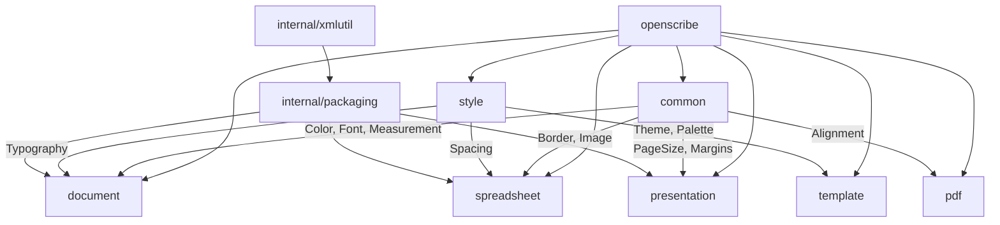

<div align="center">

# OpenScribe

**Pure Go library for creating, editing, and manipulating office documents**

[](https://go.dev)
[](LICENSE)
[](https://github.com/JohnPitter/openscribe/actions)
[](https://goreportcard.com/report/github.com/JohnPitter/openscribe)

[Features](#features) · [Architecture](#architecture) · [Getting Started](#getting-started) · [Design Levels](#design-levels) · [API Examples](#api-examples) · [Tech Stack](#tech-stack)

</div>

---

## What is OpenScribe?

OpenScribe is an **open-source, pure Go** library for creating and manipulating office documents — DOCX, XLSX, PPTX, and PDF — with zero external dependencies for core functionality.

Inspired by [UniDoc's](https://github.com/unidoc) suite of Go libraries (unioffice, unipdf, unihtml), OpenScribe provides a **free, MIT-licensed alternative** with a focus on:

- **Design quality** — Built-in themes from basic to premium (Behance/Freepik/Slidesgo quality)
- **Developer experience** — Fluent API with chainable methods and sensible defaults
- **Zero dependencies** — Pure Go using only the standard library
- **Full lifecycle** — Create, read, edit, and delete documents programmatically

Unlike commercial alternatives, OpenScribe is **completely free** for personal and commercial use.

---

## Features

| Category | What you get |
|----------|-------------|
| **DOCX** | Create, open, edit, save. Paragraphs, headings (1-6), tables, images, page breaks, sections, fonts, colors, borders |
| **XLSX** | Create, open, edit, save. Multiple sheets, cell types (string, number, boolean, formula), merged cells, formatting, column widths |
| **PPTX** | Create, open, edit, save. Slides, text boxes, shapes (12 types), transitions, speaker notes, backgrounds, slide reordering |
| **PDF** | Create, save, merge. Text, lines, rectangles, tables, watermarks, page backgrounds, multi-page documents |
| **Design System** | 6 pre-built themes across 4 levels (Basic → Luxury). Palettes, typography, spacing — all customizable |
| **Templates** | Ready-to-use document templates for reports, invoices, dashboards, pitch decks at every design level |
| **Pure Go** | Zero CGO, zero external deps. Compiles anywhere Go runs |

---

## Architecture



| Package | Description |
|---------|-------------|
| `common` | Shared types — Color, Font, Measurement, Border, Image, Alignment |
| `style` | Design system — Theme, Palette, Typography, Spacing with 6 pre-built themes |
| `template` | Pre-built document templates across all formats and design levels |
| `document` | DOCX creation and editing via Office Open XML |
| `spreadsheet` | XLSX workbook and worksheet management via SpreadsheetML |
| `presentation` | PPTX slide creation with shapes, text, and transitions |
| `pdf` | Pure Go PDF generation with text, graphics, and tables |
| `internal/packaging` | ZIP-based OOXML packaging engine |
| `internal/xmlutil` | XML marshaling utilities |

---

## Design Levels

OpenScribe supports **4 tiers of design quality**, from everyday documents to agency-grade productions:

```
┌─────────────────────────────────────────────────────────────────┐
│  🏷️ Basic          Clean, minimal designs for everyday use       │
│  📋 Professional   Business-grade with corporate palettes        │
│  ⭐ Premium        Behance/Freepik quality — modern & elegant    │
│  💎 Luxury         Slidesgo/Agency-grade — bold & sophisticated  │
└─────────────────────────────────────────────────────────────────┘
```

| Level | Theme Presets | Best For |
|-------|--------------|----------|
| Basic | `BasicClean` | Notes, drafts, internal docs |
| Professional | `ProfessionalCorporate` | Reports, proposals, contracts |
| Premium | `PremiumModern`, `PremiumElegant` | Marketing materials, client deliverables |
| Luxury | `LuxuryAgency`, `LuxuryWarm` | Pitch decks, brand books, executive presentations |

---

## Getting Started

### Prerequisites

- **Go 1.22+**

### Installation

```bash
go get github.com/JohnPitter/openscribe
```

### Quick Start

#### Create a DOCX Document

```go
package main

import (
    "github.com/JohnPitter/openscribe/document"
    "github.com/JohnPitter/openscribe/style"
)

func main() {
    // Create with a premium theme
    doc := document.NewWithTheme(style.PremiumModern())

    // Add content
    doc.AddHeading("Quarterly Report", 1)
    doc.AddText("This report covers Q1 2026 performance metrics.")

    // Add a table
    tbl := doc.AddTable(3, 2)
    tbl.Cell(0, 0).SetText("Metric")
    tbl.Cell(0, 1).SetText("Value")
    tbl.Cell(1, 0).SetText("Revenue")
    tbl.Cell(1, 1).SetText("$1.2M")
    tbl.Cell(2, 0).SetText("Growth")
    tbl.Cell(2, 1).SetText("+23%")

    doc.Save("report.docx")
}
```

#### Create an XLSX Spreadsheet

```go
package main

import (
    "github.com/JohnPitter/openscribe/spreadsheet"
    "github.com/JohnPitter/openscribe/common"
)

func main() {
    wb := spreadsheet.New()
    sheet := wb.AddSheet("Sales Data")

    // Headers
    headers := []string{"Product", "Q1", "Q2", "Q3", "Q4", "Total"}
    for i, h := range headers {
        sheet.Cell(1, i+1).SetString(h)
        sheet.Cell(1, i+1).SetFont(common.NewFont("Arial", 11).Bold())
    }

    // Data
    sheet.SetValue(2, 1, "Widget A")
    sheet.SetValue(2, 2, 15000.0)
    sheet.SetValue(2, 3, 18000.0)
    sheet.Cell(2, 6).SetFormula("SUM(B2:E2)")

    wb.Save("sales.xlsx")
}
```

#### Create a PPTX Presentation

```go
package main

import (
    "github.com/JohnPitter/openscribe/presentation"
    "github.com/JohnPitter/openscribe/common"
    "github.com/JohnPitter/openscribe/style"
)

func main() {
    pres := presentation.NewWithTheme(style.LuxuryAgency())

    // Title slide
    slide := pres.AddSlide()
    slide.SetBackground(common.NewColor(10, 10, 10))

    title := slide.AddTextBox(common.In(1), common.In(2), common.In(10), common.In(2))
    title.SetText("Product Launch", common.NewFont("Helvetica", 44).Bold().WithColor(common.White))

    // Content slide
    s2 := pres.AddSlide()
    s2.AddShape(presentation.ShapeRoundedRectangle,
        common.In(1), common.In(1), common.In(4), common.In(3))

    pres.Save("pitch.pptx")
}
```

#### Create a PDF

```go
package main

import (
    "github.com/JohnPitter/openscribe/pdf"
    "github.com/JohnPitter/openscribe/common"
)

func main() {
    doc := pdf.New()
    page := doc.AddPage()

    // Title
    page.AddText("Invoice #1042", 72, 72,
        common.NewFont("Helvetica", 28).Bold())

    // Table
    tbl := page.AddTable(72, 150, 4, 3)
    tbl.SetCellSize(150, 25)
    tbl.SetHeaderBackground(common.DarkGray)
    tbl.SetCell(0, 0, "Item")
    tbl.SetCell(0, 1, "Qty")
    tbl.SetCell(0, 2, "Price")

    // Watermark
    doc.AddWatermark(pdf.NewWatermark("PAID"))

    doc.Save("invoice.pdf")
}
```

---

## API Examples

### Applying Themes

```go
// Use any pre-built theme
doc := document.NewWithTheme(style.BasicClean())
doc := document.NewWithTheme(style.ProfessionalCorporate())
doc := document.NewWithTheme(style.PremiumModern())
doc := document.NewWithTheme(style.PremiumElegant())
doc := document.NewWithTheme(style.LuxuryAgency())
doc := document.NewWithTheme(style.LuxuryWarm())

// Browse themes by level
themes := style.ThemesByLevel(style.DesignLevelPremium)
```

### Rich Text Formatting

```go
p := doc.AddParagraph()
r := p.AddRun()
r.SetText("Bold & Red").SetBold(true).SetColor(common.Red).SetSize(16)

// Or use Font objects
font := common.NewFont("Georgia", 14).Bold().Italic().WithColor(common.Blue)
r.SetFont(font)
```

### Merged Cells & Formulas

```go
sheet.MergeCells(1, 1, 1, 4) // Merge A1:D1
sheet.Cell(5, 1).SetFormula("SUM(A1:A4)")
```

### PDF Merge

```go
merged := pdf.Merge(doc1, doc2, doc3)
merged.Save("combined.pdf")
```

---

## Tech Stack

<div align="center">

| Layer | Technology |
|-------|-----------|
| Language | Go 1.22+ |
| Document Formats | OOXML (DOCX/XLSX/PPTX), PDF 1.4 |
| XML Processing | `encoding/xml` (stdlib) |
| ZIP Packaging | `archive/zip` (stdlib) |
| Testing | `testing` (stdlib) |
| CI/CD | GitHub Actions |

</div>

---

## Project Structure

```
openscribe/
├── common/              # Shared types (Color, Font, Measurement, Border, Image)
│   ├── color.go
│   ├── font.go
│   ├── measurement.go
│   ├── border.go
│   └── image.go
├── style/               # Design system (Theme, Palette, Typography)
│   ├── theme.go
│   ├── palette.go
│   ├── typography.go
│   └── presets.go       # 6 pre-built themes
├── template/            # Document templates (Basic → Luxury)
│   ├── template.go
│   ├── basic.go
│   ├── professional.go
│   ├── premium.go
│   └── luxury.go
├── document/            # DOCX support
│   ├── document.go
│   ├── paragraph.go
│   ├── run.go
│   ├── table.go
│   ├── section.go
│   └── build.go
├── spreadsheet/         # XLSX support
│   ├── workbook.go
│   ├── sheet.go
│   ├── cell.go
│   ├── row.go
│   └── build.go
├── presentation/        # PPTX support
│   ├── presentation.go
│   ├── slide.go
│   ├── textbox.go
│   ├── shape.go
│   └── build.go
├── pdf/                 # PDF support
│   ├── pdf.go
│   ├── page.go
│   ├── elements.go
│   ├── watermark.go
│   └── build.go
├── internal/
│   ├── packaging/       # ZIP/OOXML packaging
│   └── xmlutil/         # XML helpers
├── e2e/                 # End-to-end tests
├── Makefile
├── go.mod
└── README.md
```

---

## Make Commands

| Command | Description |
|---------|-------------|
| `make build` | Build the project |
| `make test` | Run all tests |
| `make test-coverage` | Generate coverage report |
| `make e2e` | Run end-to-end tests |
| `make lint` | Run linter |
| `make fmt` | Format code |
| `make clean` | Clean build artifacts |

---

## Contributing

Contributions are welcome! Please feel free to submit a Pull Request.

1. Fork the repository
2. Create your feature branch (`git checkout -b feature/amazing-feature`)
3. Commit your changes (`git commit -m 'Add amazing feature'`)
4. Push to the branch (`git push origin feature/amazing-feature`)
5. Open a Pull Request

---

## License

This project is licensed under the MIT License — see the [LICENSE](LICENSE) file for details.

---

<div align="center">

Built with Go by [JohnPitter](https://github.com/JohnPitter)

</div>
